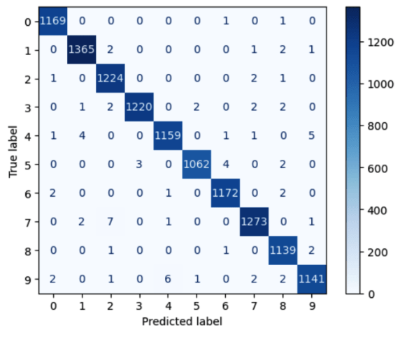
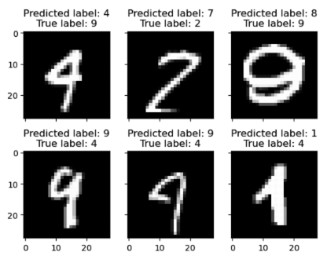
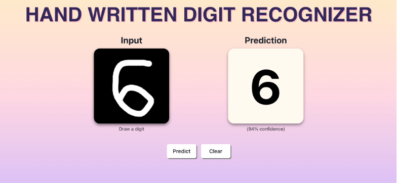

Eric Nguyen, Mary Le

Professor Gao

CIS 3715 - Principles of Data Science

April 28, 2023

# Final Report &ndash; Handwritten Digit Recognition

**Introduction**

Handwritten digit recognition is a challenging computer vision problem due to the many variations each digit can be written.
A digit can be written in a large or small font, in curved or jagged strokes, or can be written in an otherwise distorted manner (e.g., noise, shift, skew, etc.).
Further, many digits share common patterns such as the round curves that are found in digits 0, 2, 3, 5, 6, 8, and 9 or are written using similar strokes such as the vertical lines common between digits 1 and 7 or the loops common between digits 4 and 9.
With different digits sharing so many common patterns, it makes it difficult for computers to learn how to distinguish between different digits.

The Modified National Institute of Standards and Technology (MNIST) data set is a data set created in 1998 consisting of labeled handwritten digits in a 28x28x1 (width, height, channel) image format with a train set of 60,000 images written by a group of 250 contributors and a test set of 10,000 images written by a separate group of 250 contributors; amounting to approximately 11.6 megabytes (MB) for the entire dataset which is formatted as sequences of bytes and compressed into GZIP format \[1\].
This data set is a modified subset of the National Institute of Standards and Technology (NIST) data set created in 1995 which is composed of 814,255 digit and alphabetical character images.
To obtain these images, NIST coordinated a group of high school students and a group of Census Bureau employees to fill out a total of 3669 so-called "Handwriting Sample Forms" (HSF) from which each digit and alphabetic character written in the HSFs were segmented into a 128x128 binary image and labeled one of 62 ASCII classes ranging from "0"-"9", "A"-"Z" and "a"-"z" \[2\].
The MNIST data set uses the images of digits from the NIST data set and normalizes each of those images into a 20x20 box, retaining the aspect ratio.
The binary images are turned into grayscale as a result of anti-aliasing techniques used in the normalization process and are centered in a 28x28 box.
The MNIST data set is a great introduction to computer vision because all the data is already preprocessed and it has been reviewed and tested countless times in academic literature and research, showing that it is a reliable data set to use \[3\].

For our project, we chose the _Digit Recognizer_ challenge on Kaggle \[4\] where the challenge is to correctly identify the digits as provided in the MNIST data set.
For the purposes of the Kaggle competition, 42,000 images are used for training and 28,000 images are used for testing with the images provided as comma-separated value (CSV) files, amounting to approximately 128 MB in total.
The first column of the Kaggle train set specifies the label of the digit and the remaining 784 columns represent the image's pixel grayscale values which range from 0 to 255.
The Kaggle test set follows the same format as the train set except it excludes the label column&mdash;this is what we use to generate our submission file.
In our submission to the Kaggle competition, we will generate a CSV file with an _ImageId_ column and a _Label_ column with our predictions for each image which will be scored based on accuracy.

In a review of the literature regarding handwritten digit recognition of the MNIST data set, we find that the best-performing approaches for this task use a majority voting ensemble of convolutional neural networks (CNN) with state-of-the-art results achieving 99.91% accuracy on the MNIST test data set \[5\].
Indeed, the approach of using an ensemble of CNNs has seen success in similar competitions, such as the _Inclusive Images Challenge_ on Kaggle \[6\] where the top-scoring solutions used this same approach to label objects found in high-resolution, natural images with 1.7 million images to label and over 7000 labels to choose from.
Alternative approaches to handwritten digit recognition include using linear neural networks, k-nearest neighbors (KNN), boosted stumps, non-linear neural networks, support vector machines (SVM), and multi-layer neural networks which all perform relatively well (many of these approaches already achieve \>97% accuracy) with the worst performing model being the single layer linear neural network getting an error rate of 12% (i.e., 88% accuracy) \[1\].

In summary of the individual contributions each group member made, Eric researched the literature regarding handwritten digit recognition, contributed to writing the project proposal and progress reports, and implemented the models in TensorFlow.
Mary carried out the exploratory data analysis (EDA), experimented with cross-validation and evaluation using other metrics such as recall, precision, and F1 score, preprocessed the data using min-max feature scaling, and designed the web interface for deployment of the model.

**Approach**

Before we start working on building a model for handwritten digit recognition, we need to understand the data we are working with through exploratory data analysis (EDA). As such, our first step will be to explore the data set by plotting samples from the data set, detecting class imbalance, and calculating the statistics of the features.

Once we complete the EDA process, we will determine if there is any need to preprocess the dataset such as splitting the data into training and validation sets, applying feature scaling, augmenting the data, and applying dimensionality reduction through principal components analysis (PCA).
We already know that the data does not have any categorical features or missing values, so it is not necessary to check for these.

After preprocessing our data set, we will begin working on a baseline model using KNN and Euclidean distance as our distance metric.
Additionally, we will apply grid search cross-validation to determine optimal hyperparameters such as the number of neighbors to use for our model.

As a final step, we will construct an improved model using a majority vote ensemble of three different CNNs.
The CNNs will be optimized using the adaptive moment estimation (Adam) algorithm with a cross-entropy loss objective.
The CNN architecture does not significantly affect our model performance, so we will opt to use simple CNN architectures such as those used in the state-of-the-art approach \[5\].
While these architectures use batch normalization layers, we may also experiment with other normalization layers such as group normalization, instance normalization, and layer normalization.
Normalization layers are commonly used to improve model performance as well as help training convergence.

**Results**

In our EDA, we checked for missing values and categorical variables, checked for class imbalance, plotted image samples from our data set (Figures 1a, 1b), and plotted the distribution of pixel values across the data set (Figures 2a, 2b).
We found that the data set contains no missing values nor categorical variables, that the classes are balanced (Figure 3), and that the pixel values show a long tail distribution towards the left for both the train and test set.
Since there are no missing values, there is no need to remove features with missing values or fill in missing values.
Since there are no categorical variables, we do not need to apply any procedures such as label encoding or one-hot encoding to our features.
The classes are balanced, so we can use accuracy as our evaluation metric.
Because the data is very sparse, we would like to find ways to reduce the dimensionality of the data using methods such as principal component analysis (PCA) or singular value decomposition (SVD).

For preprocessing the data set, we experimented with PCA with no success as it resulted in a massive decrease in our model's performance.
We ended up only applying min-max feature scaling to the pixel values which appeared to heavily influence our model performance for the neural network approaches.

Figure 1: (a) First 10 images from the train set. (b) First 10 images from the test set.

Figure 2: (a) Pixel value distribution of the train set. (b) Pixel value distribution of the test set.

Figure 3: Digit label distribution of the train set.

In order to verify the performance of our model before submitting it for evaluation on the competition test set, we decided to split the train dataset into two train-test validation sets using a 71%-29% train-test split.
We worked on a baseline model using the K-nearest neighbors (KNN) algorithm with k=1 neighbors and Euclidean distance.
The KNN model achieved an accuracy of 97.01%.
We also tried to apply grid search cross-validation (only using 2 folds for k values from 1 to 5 due to time constraints), however this did not affect the performance.

To gain a higher prediction accuracy, we implemented an improved model using a multilayer perceptron (MLP).
The MLP architecture consisted of a 28x28 flatten layer as input, a dense layer of size 128 using rectified linear unit (ReLU) activation, a dropout layer with a dropout rate of 20%, another dense layer of size 10 using softmax activation as the output.
We trained the model for 100 epochs using the adaptive moment estimation (Adam) optimizer with default parameters (learning rate of 0.001, beta 1 of 0.9, beta 2 of 0.999, etc.) and the sparse categorical cross entropy loss function.
We also used a learning rate scheduler that multiplies the learning rate by _exp(-0.1)_ after 10 epochs.
Compared to the baseline model with KNN, the MLP model achieved an improved accuracy of 97.91%.

As we knew that there were still better methods that we could use to further improve our model's accuracy, we worked on developing a CNN model.
We replaced our MLP's input layer with a convolutional layer using 32 filters of size 5x5, a stride of one, zero padding, and ReLU activation, a consecutive convolutional layer with the same configuration, a max pooling layer with a pool size of 2x2, and a flatten layer.
This simple architectural change gave our model a +0.86% improvement from our previous best accuracy of 97.91% using MLP, resulting in an accuracy of 98.77%.

We then tried to use the _C1_ model architecture as mentioned in \[5\] which increased the number of filters in each convolutional layer to 64 and 128 for the first and second layers respectively, added batch normalization layers after each convolutional and dense layer, and excluded the dropout layer. This further improved our model accuracy to 99.25%.

Our final result showed that using an ensemble of 3 CNN models achieved the highest accuracy for handwritten digit recognition. In our experiment, we created three CNN models _C1_, _C2_, and _C3_ from \[5\], and then utilized a majority voting ensemble to combine their predictions. With each model trained on 25 epochs, we finally achieved our best accuracy of 99.38%.

Figure 4: (Left) Multi-class confusion matrix. (Right) Sample images that our model had the highest error with.

The multi-class confusion matrix was used to visualize the predictions compared to the actual values of the ensemble of 3 CNN models.
From Figure 4, the diagonal with dark blue color represents that the model gains a high number of correct predictions for most classes, with only a few misclassifications.
These misclassifications mainly occur between visually similar digits such as 4s and 9s, or 2s and 7s.

For easy and convenient use of the handwritten digit recognition model, we deployed the model into a website (shown in Figure 5) using TensorFlow.js.
We used the Chakra UI design system to create a user-friendly interface and a canvas sketch board to draw a digit using a mouse or touchscreen.
The pixel values of the drawn digit are resized to 28x28 then passed into the model for prediction.
The model returns a predicted digit label, which is then displayed on the web page.
Finally, we used Vercel to host the website and provide free, fast, and scalable hosting for the application which integrates seamlessly with GitHub which is the code hosting solution that we use.

Figure 5: Handwritten digit recognition website.

**Conclusion**

Our project showed that CNNs are currently the most effective approach to recognizing digits in the MNIST data set.
However, there are certain steps that are crucial to obtaining high accuracy.
This includes min-max normalization of the feature data, increasing the size of the layers, increasing the number of epochs, adding batch normalization layers, and creating an ensemble of multiple CNNs.
These steps allowed us to achieve a 99.38% in the Kaggle competition, which as of April 28, 2023, puts us at 233 out of 1,593 teams which is within the 15th percentile.
Our model's predictions showed that many of the digits that were not classified correctly were indeed written in a way that would be hard for even a human to distinguish, indicating that it would be very hard to get 100% accuracy on the data set.
Because the MNIST data set is publicly available, there are competitors who were able to obtain 100% accuracy, however the best legitimate methods appear to have a best accuracy of \99.8%.

**Acknowledgements**

\[1\]
[[http://yann.lecun.com/exdb/mnist/index.html]{.underline}](http://yann.lecun.com/exdb/mnist/index.html)
(MNIST Database)

\[2\]
[[https://www.nist.gov/srd/nist-special-database-19]{.underline}](https://www.nist.gov/srd/nist-special-database-19)
(NIST Special Database 19)

\[3\]
[[https://ieeexplore.ieee.org/document/726791]{.underline}](https://ieeexplore.ieee.org/document/726791)
(Gradient-based learning applied to document recognition)

\[4\]
[[https://www.kaggle.com/competitions/digit-recognizer]{.underline}](https://www.kaggle.com/competitions/digit-recognizer)
(Digit Recognizer Kaggle Competition)

\[5\]
[[http://arxiv.org/abs/2008.10400]{.underline}](http://arxiv.org/abs/2008.10400)
(An Ensemble of Simple Convolutional Neural Network Models for MNIST
Digit Recognition)

\[6\]
[[https://www.kaggle.com/competitions/inclusive-images-challenge]{.underline}](https://www.kaggle.com/competitions/inclusive-images-challenge)
(Inclusive Images Kaggle Competition)
