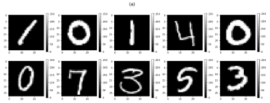
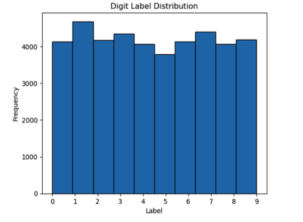
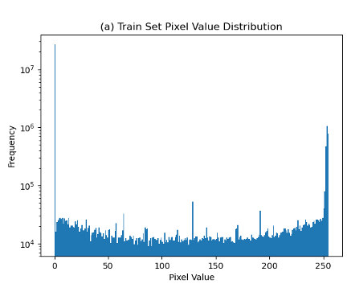

Eric Nguyen, Mary Le

Professor Hongchang Gao

CIS 3715 - Principles of Data Science

April 5, 2023

# Progress Report I

**What has been done**

For the first week of the project, we have completed the exploratory data analysis (EDA), data preprocessing, and k-nearest neighbors (KNN) baseline model for our handwritten digit recognition project.

In our EDA, we checked for missing values and categorical variables, checked for class imbalance, plotted image samples from our data set (Figures 1a, 1b), and plotted the distribution of pixel values across the data set.
We found that the data set contains no missing values nor categorical variables, that the classes are balanced (Figure 2), and that the pixel values show a long tail distribution towards the left for both the train and test set (Figures 3a, 3b), implying that the data is very sparse (contains many zeros).
Since there are no missing values, there is no need to remove features with missing values or fill in missing values.
Since there are no categorical variables, we do not need to apply any procedures such as label encoding or one-hot encoding to our features.
The classes are balanced, so we can use accuracy as our evaluation metric.
Because the data is very sparse, we would like to find ways to reduce the dimensionality of the data using methods such as principal components analysis (PCA) or singular value decomposition (SVD).

Figure 1: (a) First 10 images from the train set. (b) First 10 images from the test set.

Figure 2: Digit label distribution of the train set.

Figure 3: (a) Pixel value distribution of the train set. (b) Pixel value distribution of the test set.

For preprocessing the data set, we first experimented with PCA.
We found that when we applied PCA, the model performance reduced drastically.
When we used N=2 components, our baseline model's accuracy reduced from 97.01% to 10.83%.
We also tried to use N=600 components, however our model's accuracy was still significantly impacted, still only obtaining a 56.96% accuracy.
Aside from PCA, we also experimented with feature scaling via standardization of the pixel values to be between 0 and 1 by dividing them by the max possible value to make the training process more stable, however this does not appear to have a noticeable effect on the model performance.

After preprocessing and analyzing the dataset, we worked on a baseline model using the k-nearest neighbors (KNN) algorithm.
For our initial iteration of the model, we use k=1 neighbors and Euclidean distance on non-preprocessed data, obtaining a 97.01% accuracy with the entire model taking less than a second to be trained.
We then tried to use a grid search cross-validation approach to find the optimal number of neighbors by splitting the train set into separate train and validation sets using a 0.7143:0.2857 train-validation ratio.
Due to time constraints (for our baseline model, we want to be able to develop rapidly so we prefer processes that take than less than a minute to run), we initially used 2-fold cross-validation and found k=3 to give the best accuracy, taking approximately 1 minute and 42 seconds for the cross-validation to complete.
However, this method still did not impact our model performance, as we still achieved a 97.01% accuracy using the optimal number of neighbors as given by grid search cross-validation.

**What has not been done**

Although we have made good progress in developing the system with KNN, there are still some areas that need improvement.
We have not yet experimented with more complex models such as convolutional neural networks (CNN) to achieve higher model's accuracy.

**What will be done during the following week**

For the following week, we would work on improving the model and aim for a higher model accuracy using an ensemble of CNN models as this appears to be the most promising approach.
After that, we would focus on evaluating their performance using cross-validation and fine-tuning the CNN model and improving its accuracy by experimenting with different normalization layers.
In addition, we will start working on deploying the model in a web application to enable practical use and testing.
