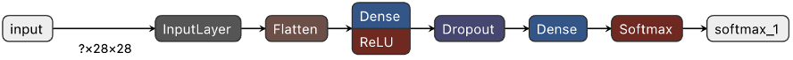
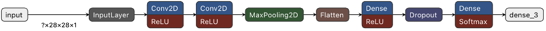
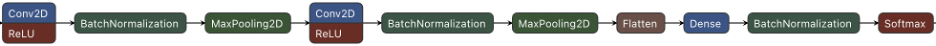

Eric Nguyen, Mary Le

Professor Hongchang Gao

CIS 3715 - Principles of Data Science

April 16, 2023

# Progress Report II

**What has been done**

For the second week of the project, we have implemented an improved model for handwritten digit recognition using fully connected neural networks, also known as multilayer perceptrons (MLP), and convolutional neural networks (CNN).
For the initial iteration of our improved model, we used a simple MLP architecture consisting of a flatten layer of shape 28x28 as the input, a dense layer of size 128 using rectified linear unit (ReLU) activation, a dropout layer with a dropout rate of 20%, another dense layer of size 10, and then a softmax layer as the output (see Figure 1).
This model was trained for five epochs on the entire training set using the adaptive moment estimation (Adam) optimizer with default parameters (learning rate of 0.001, beta 1 of 0.9, beta 2 of 0.999, etc), sparse categorical cross-entropy loss function, and accuracy metric, scoring accuracy of 92.46% on the competition test set.
Compared to our baseline model which had an accuracy of 97.01%, this performance was clearly not an improvement.
We then tried to normalize our data by dividing the pixel values by 255 and applying the same training procedure which allowed us to get an accuracy of 97.06% which was indeed an improvement of +0.05% accuracy from our baseline model.
To increase the accuracy even further, we tried to simply increase the number of epochs from five to 100, which allowed us to get an accuracy of 97.54%.
Then we experimented with exponentially decaying the optimizer's learning rate, which allowed us to get an accuracy of 97.91%.

Figure 1: Our MLP architecture.

While we were able to achieve improved accuracy on our model, we realized that it was hard to verify the performance of our model before submitting it for evaluation on the competition test set.
To deal with this issue, we decided to split the train data into two train-test validation sets using a 0.7143:0.2857 train-test split.
We then would evaluate the accuracy of the model on the validation sets as a sanity check before evaluating it on the competition test set.
This process was also useful to help us better understand our model performance by performing other checks such as calculating the precision, recall, and F1 scores of our model for each label, creating a confusion matrix of true versus predicted labels, plotting image examples that had the highest error with the predictions, and plotting loss and accuracy graphs.

After applying this validation method, we reverted to using a constant learning rate of 0.001 and 25 epochs as an initial submission which got an accuracy of 97.31%.
Upon inspecting some of the new information we were able to gather as a result of our validation process, we found that the model tends to perform worse when recognizing digits 8 and 9 as they received the lowest F1 score of 96% whereas the rest of the digits had \>96% F1 scores.
Additionally, we also found that the handwritten digit examples with the highest error rate were written quite poorly (for example, a digit that has a true label of 9 may look like a 0), as we expected.

While our MLP was able to achieve slight improvement over the baseline k-nearest neighbors model (KNN), we knew that there were still better methods we could use to further improve our model's accuracy such as using CNNs.
As an initial experimentation with CNN, we replaced our MLP's input layer with a convolutional layer using 32 filters of size 5x5, a stride of one, zero padding, and ReLU activation, a consecutive convolutional layer with the same configuration, a max pooling layer with a pool size of 2x2, and a flatten layer (see Figure 2).
This simple architectural change resulted in an accuracy of 98.77%, an +0.86% improvement from our best accuracy of 97.91% using MLP.
From our validation results, we also found that the CNN was able to achieve a 99% F1 score on all labels except for digit 9 which received an F1 score of 98% which indicates some sense of universal difficulty for computers to recognize the digit 9.

Figure 2: Our CNN architecture.

With the CNN, we have now achieved an overall improvement of +1.75% accuracy from our baseline KNN model.
However, there are even further improvements to be made to our model, including the use of normalization layers and ensemble (majority voting) methods.
First, we experimented with adjusting the architecture of our CNN to match that of the _C1_ model from \[1\] which increased the number of filters in each convolutional layer to 64 and 128 for the first and second layers respectively, added batch normalization layers after each convolutional layer and dense layer, and excluded the dropout layer.
Indeed, this architecture further improved our model's accuracy to 99.25%.
Next, we experimented with a majority voting ensemble of three CNNs based on the _C1_, _C2_, and _C3_ models from \[1\] (see Figure 3).
For our initial attempt at the ensemble method, we only used one epoch to train each model to verify our code would work since training all the models would take considerably longer than training just one model.
With each model trained on one epoch, we were already able to achieve a 98.94% accuracy through the ensemble method.
We then increased the number of epochs to 25 and achieved our best accuracy of 99.38%, an improvement of +2.36% compared to our baseline model\'s accuracy.

Figure 3: The three CNN architectures used for our ensemble method based on the _C1_ (top), _C2_ (middle), and _C3_ (bottom) models from \[1\] (cropped for readability).

**What has not been done**

We were unable to complete the interactive website as it was more challenging than anticipated.
Specifically, we are trying to implement a canvas which the user can draw on, however our JavaScript knowledge is limited.
We have also yet to prepare for our presentation lightning talk such as creating slides, nor have we started working on our final report.

**What will be done the following week**

For the following week, we will complete the website and start working on the lightning talk and the final report.

**References**

\[1\]
[http://arxiv.org/abs/2008.10400](http://arxiv.org/abs/2008.10400)
(An Ensemble of Simple Convolutional Neural Network Models for MNIST
Digit Recognition)
